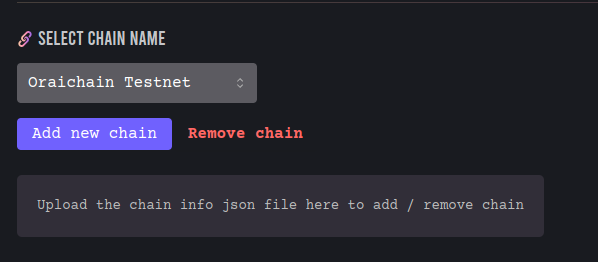

# Custom Chains

This documentation displays how to add or remove a custom CosmWasm based network on CosmWasm IDE. *Warning: this is a **work in process**, please contribute & create new PRs on the [following repo](https://github.com/oraichain/cw-ide-webview) if there are any problems you may face*.

CosmWasm IDE allows developers to manually add new custom CosmWasm based networks apart from those that have been natively integrated. This includes local or testnets that you want to use before deploying to the main network. It is an attempt to make CosmWasm IDE permissionless, providing CosmWasm developers a simple yet powerful and flexible platform to build & deploy smart contracts.

We make use of the Keplr's chain info interface to add custom chains because we also use Keplr to sign transactions when the IDE is used on VSCode browser. so the developers may feel familliar with it because Keplr is a popular wallet within the Cosmos ecosystem. We only add one additional additribute to filter each network's CosmWasm Std version.

```js
interface ChainInfo {
    readonly rpc: string;
    readonly rest: string;
    readonly chainId: string;
    readonly chainName: string;
    /**
    * This indicates the type of coin that can be used for stake.
    * You can get actual currency information from Currencies.
    */
    readonly stakeCurrency: Currency;
    readonly walletUrlForStaking?: string;
    readonly bip44: {
        coinType: number;
    };
    readonly alternativeBIP44s?: BIP44[];
    readonly bech32Config: Bech32Config;
    
    readonly currencies: AppCurrency[];
    /**
    * This indicates which coin or token can be used for fee to send transaction.
    * You can get actual currency information from Currencies.
    */
    readonly feeCurrencies: Currency[];
    
    /**
    * This is used to set the fee of the transaction.
    * If this field is empty, it just use the default gas price step (low: 0.01, average: 0.025, high: 0.04).
    * And, set field's type as primitive number because it is hard to restore the prototype after deserialzing if field's type is `Dec`.
    */
    readonly gasPriceStep?: {
        low: number;
        average: number;
        high: number;
    };
    
    /**
    * Indicate the features supported by this chain. Ex) cosmwasm, secretwasm ...
    */
    readonly features?: string[];

    /**
    * The cosmwasm std your network is using 
    */
    readonly cosmwasmVersion: string;
}

```

Please view the example file [here](./chain.json)

You can upload the json file through the IDE webivew:

<p align="center">
    <a target="_blank" rel="noopener noreferrer"></a>
</p>

After uploading, click **Add new chain** for confirmation, and you will see your network in the bottom of the list.